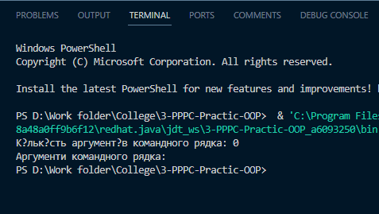
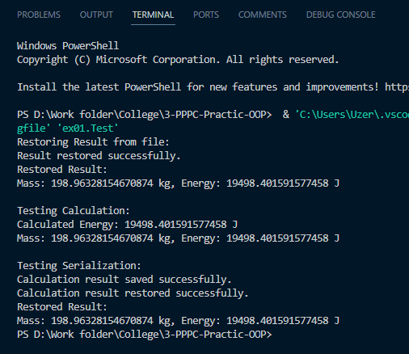
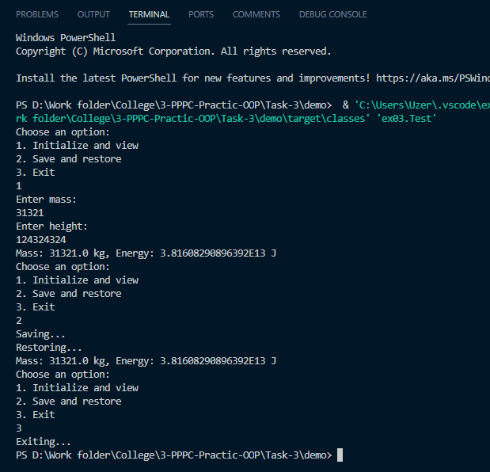

# 3-PPPC-Practic-OOP

"ППФК" НТУ "ХПІ" / Розробка програмного забезпечення / 3-й курс / Практика / Об'єктно-орієнтоване програмування

## Task 1

### Завдання

Написати просту консольну програму (наприклад вивід на екран аргументів командної строки).

### Робота програми

## Task 2

### Завдання

Розробити клас, що серіалізується, для зберігання параметрів і результатів обчислень. Використовуючи агрегування, розробити клас для знаходження рішення задачі. Розробити клас для демонстрації в діалоговому режимі збереження та відновлення стану об'єкта, використовуючи серіалізацію. Показати особливості використання transient полів. Розробити клас для тестування коректності результатів обчислень та серіалізації/десеріалізації.

### Робота програми

## Task 3

### Завдання

Як основа використовувати вихідний текст проекту попередньої лабораторної роботи. Забезпечити розміщення результатів обчислень уколекції з можливістю збереження/відновлення. Використовуючи шаблон проектування Factory Method (Virtual Constructor), розробити ієрархію, що передбачає розширення рахунок додавання нових відображуваних класів. Розширити ієрархію інтерфейсом "фабрикованих" об'єктів, що представляє набір методів для відображення результатів обчислень. Реалізувати ці методи виведення результатів у текстовому виде. Розробити тареалізувати інтерфейс для "фабрикуючого" методу.

### Робота програми

